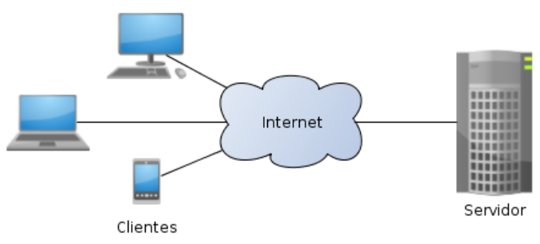

# Aula - Arquitetura da Web

<p align="center">
  <a href="#">
    
  </a>
  <a href="#">
    
  </a>
</p>

## Índice

* [Introdução](#introdução)
* [Recursos Utilizados](#recursos-utilizados)
* [Evolução da Internet](#evolução-da-internet)
* [Evolução da Web](#evolução-da-web)
* [Evolução das Tecnologias Web](#evolução-das-tecnologias-web)
* [Modelo Cliente-Servidor](#modelo-cliente-servidor)
* [Modelo Requisição-Resposta](#modelo-requisição-resposta)
* [Protocolos TPC e UDP](#protocolos-tpc-e-udp)
* [Protocolos HTTP e HTTPS](#protocolos-http-e-https)
* [Frontend e Backend](#frontend-e-backend)
* [Servidores Web](#servidores-web)
* [Experimentos Comunicação Cliente-Servidor](#experimentos-comunicação-cliente-servidor)
* [Experimentos Servidor Web em Python](#experimentos-servidor-web-em-python)
* [Créditos e Referências](#créditos-e-referências)

## Introdução

<a href="#índice"></a>

Aula Arquitetura da Web. Esta aula será utilizada na disciplina GAC116 - Programação Web. O objetivo dessa aula é dar uma visão geral sobre a evolução da internet, web e suas tecnologias, além apresentar as ideias principais no que tange Arquitetura Web. Ao final da aula alguns experimentos práticos serão mostrados de forma a ilustrar alguns dos conceitos apresentados.

## Recursos Utilizados

<a href="#índice"></a>

A seguir estão listados os principais recursos utilizados no desenvolvimento desta aula.

### Ambiente

* Github - Plataforma de Hospedagem de Códigos - [link](https://github.com/)

### Linguagens

* Python - Linguagem de Programação
    * [link do site python](https://www.python.org/)
    * [link do curso da w3schools](https://www.w3schools.com/python/default.asp)
* HTML - Estrutura da Página Web
    * [link do curso da w3schools](https://www.w3schools.com/html/default.asp)

### Bibliotecas

* socket
* http.server

## Evolução da Internet

<a href="#índice"></a>

A história da internet é uma jornada fascinante que abrange várias décadas e é marcada por uma série de desenvolvimentos cruciais. Aqui estão alguns dos principais destaques:

* **ARPANET (1969)**: A ARPANET, criada pela *Advanced Research Projects Agency* (ARPA) do Departamento de Defesa dos EUA, foi a primeira rede de comutação de pacotes a implementar o protocolo TCP/IP, precursor da internet moderna.

* **Protocolo TCP/IP (1970s)**: Desenvolvido por Vinton Cerf e Robert Kahn, o TCP/IP se tornou o padrão fundamental para a comunicação de dados na internet.

* **World Wide Web (1989)**: Sir Tim Berners-Lee desenvolveu o conceito da *World Wide Web* (WWW) enquanto trabalhava no CERN, introduzindo a ideia de hipertexto e URLs, criando a base para o que conhecemos como navegadores e páginas da web.

* **Navegadores (1990s)**: Marc Andreessen e sua equipe na Universidade de Illinois lançaram o Mosaic, o primeiro navegador web gráfico amplamente utilizado, que pavimentou o caminho para navegadores posteriores como Netscape Navigator e Internet Explorer.

* **Comércio eletrônico (1990s)**: O crescimento do comércio eletrônico começou a transformar a maneira como as pessoas compravam e vendiam bens e serviços, com sites como Amazon e eBay se tornando pioneiros nesse campo.

* **Boom da Internet (final dos anos 90)**: O final dos anos 90 viu um crescimento explosivo da internet, com empresas de tecnologia emergentes e investidores apostando pesadamente em startups de tecnologia, resultando em uma bolha especulativa que acabou estourando em 2000.

* **Banda larga e redes sociais (2000s)**: A disseminação da banda larga permitiu uma maior interatividade na internet, impulsionando o crescimento de redes sociais como Facebook, Twitter e LinkedIn, que se tornaram plataformas sociais dominantes.

* **Dispositivos móveis (2000s - 2010s)**: A proliferação de smartphones e tablets tornou a internet mais acessível em qualquer lugar e a qualquer momento, mudando fundamentalmente a forma como as pessoas interagem com a web.

* **Computação em nuvem (2010s)**: O surgimento da computação em nuvem permitiu o armazenamento e processamento remotos de dados, impulsionando a escalabilidade e flexibilidade de serviços online.

* **Inteligência Artificial e Internet das Coisas (IoT) (2010s)**: A integração de IA e IoT está moldando o futuro da internet, permitindo que dispositivos se comuniquem e tomem decisões autônomas, abrindo caminho para avanços significativos em áreas como veículos autônomos, assistentes virtuais e cidades inteligentes.

Esses são apenas alguns dos principais destaques na história da internet.

## Evolução da Web

<a href="#índice"></a>

**O que é a Web 1.0?**

* A Web 1.0 é a fase inicial da World Wide Web, que começou por volta do final da década de 1980 e continuou até o início dos anos 2000.
* Nesta fase, os sites eram predominantemente estáticos e unidirecionais, o que significa que as páginas da web eram basicamente visualizadas apenas para leitura, sem muita interatividade.
* Os sites geralmente eram compostos por conteúdo estático, como texto e imagens, e eram desenvolvidos principalmente por indivíduos ou organizações para fornecer informações aos usuários.
* A interação dos usuários com os sites era limitada, e não havia muitas oportunidades para os usuários contribuírem com conteúdo ou interagirem com outros usuários diretamente nos sites.

**O que é a Web 2.0?**

* A Web 2.0 representa a segunda geração da World Wide Web, que emergiu por volta do início dos anos 2000 e continua até hoje.
* Nesta fase, os sites se tornaram mais dinâmicos e interativos, permitindo uma participação mais ativa dos usuários.
* Os princípios fundamentais da Web 2.0 incluem a colaboração entre usuários, a criação de conteúdo por usuários, a interatividade e a participação social.
* A Web 2.0, também chamada de web participativa, foi a revolução dos blogs e chats, das mídias sociais colaborativas, das redes sociais e do conteúdo produzido pelos próprios internautas.

**O que é a Web 3.0?**

* A Web 3.0 é uma fase em evolução da World Wide Web, que está começando a surgir no século XXI.
* Esta fase é caracterizada por avanços em tecnologias como inteligência artificial, blockchain, realidade virtual e aumentada, internet das coisas (IoT), entre outros.
* A Web 3.0 busca criar uma web mais descentralizada, segura, inteligente e personalizada.
* Algumas das características associadas à Web 3.0 incluem a integração de inteligência artificial para personalização de conteúdo, o uso de blockchain para garantir transações seguras e transparentes, a utilização de realidade virtual e aumentada para experiências imersivas, e uma ênfase maior na privacidade e segurança dos dados dos usuários.
* O termo Web 3.0 foi criado pelo jornalista John Markoff, do New York Times, baseado na evolução do termo Web 2.0 criado por O’Really em 2004. Outras denominações desse mesmo momento são "Web Semântica" ou "Web Inteligente".


## Evolução das Tecnologias Web

<a href="#índice"></a>


[Link da Evolução das Tecnologias Web](http://127.0.0.1:5500/aula-arquitetura-web/timeline-web/index.html)

## Modelo Cliente-Servidor

<a href="#índice"></a>

O modelo cliente-servidor é uma arquitetura de rede amplamente utilizada na computação e na comunicação de dados, onde duas entidades principais, o cliente e o servidor, interagem para fornecer e consumir serviços e recursos. Esse modelo é a base da maioria das aplicações da web, sistemas de banco de dados e muitas outras tecnologias de rede.

**O Modelo Cliente-Servidor na Internet**



**O Modelo Cliente-Servidor na Intranet**


O modelo cliente-servidor é fundamental para o funcionamento de muitos sistemas modernos, oferecendo uma maneira estruturada e eficiente de distribuir recursos e serviços em uma rede.

Cada site que você acessa, seja um blog WordPress, um aplicativo como Facebook, Twitter ou seu aplicativo bancário, é construído no modelo cliente-servidor. Somente uma porcentagem muito pequena de sites e apps usa o modelo ponto a ponto (*pear to pear*) e não o modelo cliente-servidor.

* **Estrutura do Modelo Cliente-Servidor:**
    *  **Cliente:**
        * O cliente é uma aplicação ou dispositivo que faz requisições ao servidor. Ele atua como o consumidor de serviços, como um navegador de internet, aplicativo de e-mail ou software de gerenciamento de banco de dados.
        * O cliente inicia a comunicação enviando uma solicitação para o servidor. Essa solicitação pode ser uma busca por informações, um pedido de acesso a um arquivo, envio de dados, etc.
    * **Servidor:**
        * O servidor é um programa ou máquina que fornece serviços ou recursos em resposta às solicitações do cliente. Ele atua como um provedor de serviços, como um servidor web, servidor de banco de dados, ou servidor de arquivos.
        * O servidor processa as requisições recebidas e envia de volta uma resposta apropriada ao cliente. Ele pode gerenciar várias solicitações simultâneas de múltiplos clientes.
* **Funcionamento Básico:**
    * **Solicitação (Request):** O cliente envia uma solicitação ao servidor, geralmente utilizando um protocolo de comunicação como HTTP, HTTPS, FTP, ou SMTP, dependendo do tipo de serviço.
    * **Processamento:** O servidor recebe a solicitação e a processa. Esse processamento pode envolver a execução de códigos, consulta a bancos de dados, acesso a arquivos, entre outras ações.
    * **Resposta (Response):** Após o processamento, o servidor envia uma resposta ao cliente. Essa resposta pode conter dados solicitados, uma confirmação de ação ou uma mensagem de erro, caso a solicitação não possa ser atendida.

* **Características Principais:**
    * **Descentralização das Funções:** O cliente e o servidor têm funções distintas e se comunicam de forma independente, permitindo escalabilidade e especialização.
    * **Conexão Baseada em Solicitações e Respostas:** A comunicação é estabelecida por meio de solicitações do cliente e respostas do servidor, criando um fluxo de dados controlado e previsível.
    * **Escalabilidade:** Servidores podem ser configurados para atender múltiplas solicitações simultâneas, aumentando a capacidade de resposta do sistema.
    * **Segurança:** A arquitetura permite implementar diversas camadas de segurança, como autenticação de usuários, criptografia de dados, e controle de acesso, protegendo tanto os dados quanto os serviços.
* **Exemplos:**
    * **Aplicações Web:** Um navegador da web (cliente) solicita páginas a um servidor web, que processa a solicitação e envia o conteúdo da página.
    * **E-mails:** Clientes de e-mail solicitam e enviam mensagens por meio de servidores de e-mail.
    * **Bancos de Dados:** Um aplicativo de gerenciamento de banco de dados (cliente) envia comandos SQL para um servidor de banco de dados, que processa e retorna os resultados.

## Modelo Requisição-Resposta

<a href="#índice"></a>

Uma outra forma de entender (chamar) o modelo cliente-servidor é pensar como um modelo de requisição-resposta em que o cliente envia a solicitação/requisição e o servidor responde com os dados.

O protocolo HTTP é um protocolo de requisição-resposta que define como as informações são transmitidas pela web. É um protocolo sem estado, e cada processo via HTTP é executado de forma independente e não tem conhecimento dos processos anteriores.

O servidor ao receber a requisição, processa a requisição (podendo consultar dados em um BD) e devolve a resposta, geralmente com dados de HTML, CSS, JavaScript e imagens.


## Protocolos TPC e UDP

<a href="#índice"></a>

O **TCP** e o **UDP** são dois dos principais protocolos de transporte usados na comunicação de redes, especialmente na Internet. Eles operam na camada de transporte do modelo OSI e do modelo TCP/IP, sendo responsáveis por gerenciar a forma como os dados são transmitidos entre dispositivos.

**TCP (Transmission Control Protocol)**

* **Confiabilidade:** TCP é um protocolo orientado à conexão que garante a entrega dos dados de forma confiável e na ordem correta. Ele verifica se todos os pacotes enviados foram recebidos e, se não, retransmite os pacotes perdidos.
* **Controle de Fluxo e Congestionamento:** TCP ajusta dinamicamente a quantidade de dados enviados com base na capacidade da rede, evitando congestionamento e sobrecarga dos sistemas.
* **Estabelecimento de Conexão:** Antes da transmissão dos dados, TCP estabelece uma conexão entre o cliente e o servidor, garantindo que ambas as partes estejam prontas para se comunicar.
* **Uso Comum:** TCP é usado em aplicações que requerem confiabilidade e ordem na entrega de dados, como navegadores de internet (HTTP/HTTPS), e-mail (SMTP), transferência de arquivos (FTP), entre outros.

**UDP (User Datagram Protocol)**

* **Velocidade:** UDP é um protocolo sem conexão que envia pacotes (datagramas) sem garantir sua entrega, ordem, ou integridade. Ele é mais rápido que o TCP porque não realiza verificações ou retransmissões de pacotes perdidos.
* **Sem Controle de Fluxo:** UDP não ajusta o fluxo de dados com base na capacidade da rede, o que pode resultar em perda de pacotes se a rede estiver congestionada.
* **Sem Estabelecimento de Conexão:** UDP não estabelece uma conexão antes de enviar dados, o que reduz a sobrecarga e a latência, tornando-o adequado para aplicações que priorizam a velocidade.
* **Uso Comum:** UDP é usado em aplicações onde a velocidade é mais importante que a confiabilidade, como streaming de vídeo e áudio, jogos online, e protocolos de voz sobre IP (VoIP).

**Resumo das Diferenças:**

* **Confiabilidade:** TCP é confiável; UDP não é.
* **Velocidade:** UDP é mais rápido que TCP devido à falta de controle de fluxo e confiabilidade.
* **Ordem de Entrega:** TCP garante a ordem dos pacotes; UDP não.
* **Uso:** TCP é preferido para aplicações críticas onde a perda de dados é inaceitável, enquanto UDP é usado para transmissões em tempo real, onde a velocidade é essencial.

Esses protocolos são escolhidos com base nas necessidades específicas de cada aplicação, equilibrando a necessidade de confiabilidade e velocidade.

A imagem abaixo relembra rapidamente as camadas envolvidas em uma rede de computadores.


## Protocolos HTTP e HTTPS

<a href="#índice"></a>

Os protocolos **HTTP (Hypertext Transfer Protocol)** e **HTTPS (Hypertext Transfer Protocol Secure)** são protocolos de comunicação (da camada de aplicação) utilizados na transferência de dados na web, sendo fundamentais para o funcionamento da internet como a conhecemos hoje. Eles definem como os dados são formatados, transmitidos e respondidos entre clientes (como navegadores) e servidores web.

* **HTTP (Hypertext Transfer Protocol)**

    * **Definição:** HTTP é um protocolo de comunicação utilizado para a transferência de documentos hipermídia, como páginas web, imagens, vídeos, e outros conteúdos na internet. Ele funciona no modelo cliente-servidor, onde o cliente (geralmente um navegador) envia uma solicitação ao servidor, que responde com os dados solicitados.

    * **Características:**
        * **Sem Estado (Stateless):** HTTP é um protocolo sem estado, o que significa que cada solicitação é independente e não guarda informações sobre as solicitações anteriores. Isso torna o protocolo mais simples, mas também implica que, por si só, ele não mantém sessões de usuário.
        * **Métodos de Requisição:** Inclui métodos como GET (para solicitar dados), POST (para enviar dados), PUT (para enviar dados ao servidor para criar ou substituir um recurso específico), DELETE (para remover um recurso especificado no servidor), entre outros, cada um com um propósito específico na comunicação.
        * **Porta Padrão:** Utiliza a porta 80 para comunicação padrão.

    * **Uso:** HTTP é usado para acessar e transferir conteúdo da web de maneira não criptografada, sendo ainda amplamente usado em redes internas e algumas aplicações onde a segurança não é uma preocupação crítica.

* **HTTPS (Hypertext Transfer Protocol Secure)**

    * **Definição:** HTTPS é a versão segura do HTTP. Ele utiliza criptografia para proteger a comunicação entre o cliente e o servidor, garantindo que os dados trocados sejam privados e integros.

    * **Características:**
        * **Criptografia:** HTTPS utiliza protocolos de criptografia, como TLS (Transport Layer Security) ou seu antecessor SSL (Secure Sockets Layer), para criptografar os dados transmitidos, protegendo-os contra interceptação e ataques man-in-the-middle.
        * **Autenticação:** Além de criptografar, HTTPS autentica o servidor (e opcionalmente o cliente) através de certificados digitais, confirmando a identidade da parte com quem se está comunicando.
        * **Integridade dos Dados:** Garante que os dados não sejam alterados ou corrompidos durante a transmissão.
        * **Porta Padrão:** Utiliza a porta 443 para comunicação segura.

    * **Uso:** HTTPS é amplamente utilizado para proteger transações sensíveis, como login de usuários, compras online, comunicações bancárias, e qualquer troca de dados onde a segurança e a privacidade sejam essenciais. Hoje, é considerado o padrão para a maioria dos sites na internet devido à importância crescente da segurança.

### Diferenças Principais:

* **Segurança:** HTTP não oferece proteção contra interceptação ou alteração de dados, enquanto HTTPS protege a comunicação com criptografia e autenticação.
* **Portas:** HTTP usa a porta 80, enquanto HTTPS usa a porta 443.
* **Uso Atual:** HTTPS é amplamente preferido e incentivado para todos os tipos de websites, especialmente os que lidam com informações sensíveis, devido às suas vantagens de segurança.

HTTPS é uma evolução necessária do HTTP, respondendo à crescente necessidade de segurança na web, garantindo uma navegação mais segura para os usuários.

## Frontend e Backend

<a href="#índice"></a>

**Frontend** e **backend** são termos utilizados para descrever as duas partes principais de uma aplicação web ou software: a interface com o usuário (frontend) e a lógica de processamento e gerenciamento de dados (backend). Esses dois componentes trabalham juntos para criar aplicações completas e funcionais.

**Frontend**

* **Definição:** O frontend refere-se à parte da aplicação com a qual os usuários interagem diretamente. Inclui tudo o que o usuário vê e usa, como layouts, botões, menus, formulários, animações, e gráficos.

* **Principais Tecnologias:**
    * **HTML (Hypertext Markup Language):** Define a estrutura básica das páginas web.
    * **CSS (Cascading Style Sheets):** Estiliza o conteúdo da página, controlando cores, fontes, layout, etc.
    * **JavaScript:** Adiciona interatividade e dinamismo às páginas web, permitindo a criação de animações, validações de formulário, e atualizações de conteúdo sem recarregar a página.
    * **Frameworks e Bibliotecas:** Ferramentas como React, Angular, Vue.js, Bootstrap, e outros são usadas para facilitar o desenvolvimento de interfaces dinâmicas e responsivas.

* **Responsabilidade:** O frontend é responsável pela experiência do usuário (UX - User eXperience), garantindo que a interface seja intuitiva, rápida, e visualmente agradável. Ele envia requisições ao backend e exibe os dados retornados, como resultados de pesquisas, informações de perfis, entre outros.

**Backend**

* **Definição:** O backend é a parte da aplicação que funciona nos bastidores, lidando com a lógica de negócio, gerenciamento de dados, autenticação, e comunicação com bancos de dados e outras APIs. Ele processa as requisições enviadas pelo frontend e retorna as respostas adequadas.

* **Principais Tecnologias:**
    * **Linguagens de Programação:** Linguagens como Python, Java, JavaScript (Node.js), PHP e Ruby são comuns no desenvolvimento backend.
    * **Bancos de Dados:** Sistemas como MySQL, MariaDB, PostgreSQL, MongoDB, e Redis são utilizados para armazenar e gerenciar dados.
    * **Frameworks:** Ferramentas como Django (Python), Spring Boot (Java), Express (Node.js), Laravel (PHP) e Ruby on Rails (Ruby) ajudam a estruturar o código e acelerar o desenvolvimento.
    * **APIs (Application Programming Interfaces):** Interfaces que permitem a comunicação entre o frontend e o backend, bem como entre diferentes sistemas.

* **Responsabilidade:** O backend é responsável por processar as requisições recebidas do frontend, realizar cálculos, acessar bancos de dados, gerenciar sessões de usuário, e garantir que as regras de negócio sejam seguidas. Ele deve ser seguro, eficiente e capaz de lidar com múltiplas requisições simultâneas.

**Relação entre Frontend e Backend**

* **Comunicação:** Frontend e backend se comunicam através de APIs, geralmente enviando e recebendo dados no formato JSON ou XML.
* **Exemplo de Fluxo:** Quando um usuário envia um formulário de login (frontend), a solicitação é enviada ao backend, que valida as credenciais e retorna uma resposta (sucesso ou erro), que é exibida ao usuário.

**Resumo**

* **Frontend:** Envolve a interface e a experiência do usuário. Lida com o que o usuário vê e interage diretamente.
* **Backend:** Gerencia a lógica do sistema, banco de dados, e processamento de dados. Funciona nos bastidores para dar suporte ao frontend.

Esses dois componentes são essenciais para o desenvolvimento de aplicações modernas, garantindo que tanto a parte visual quanto a lógica do sistema funcionem de maneira harmoniosa e eficiente.


## Servidores Web

<a href="#índice"></a>

Servidores web são sistemas dedicados para atender requisições de clientes (como navegadores web) para fornecer conteúdo na internet. Eles recebem solicitações HTTP/HTTPS e respondem com recursos, como páginas HTML, imagens, arquivos, vídeos, ou outros tipos de dados.

**Funcionamento de um Servidor Web:**

* **Recepção da Solicitação:** Quando um usuário acessa um website, o navegador envia uma requisição ao servidor web especificado pelo endereço (URL).
* **Processamento da Solicitação:** O servidor web processa a requisição. Isso pode envolver servir diretamente arquivos estáticos ou acionar scripts e aplicações que geram o conteúdo dinamicamente (como Python, Java, PHP, ou Node.js).
* **Resposta ao Cliente:** O servidor responde ao navegador com o conteúdo solicitado, como uma página HTML, um arquivo de imagem, ou dados JSON, que são exibidos ao usuário.

**Funções de um Servidor Web:**

* **Servir Conteúdo Estático:** Entrega arquivos como HTML, CSS, JavaScript, imagens, e vídeos diretamente para o cliente.
* **Processar Conteúdo Dinâmico:** Interage com scripts ou aplicações para gerar conteúdo dinâmico, como resultados de buscas, páginas personalizadas, e formulários processados.
* **Gerenciar Requisições HTTP:** Trata de requisições GET, POST, PUT, DELETE, etc., gerenciando como os dados são enviados e recebidos.
* **Segurança e Autenticação:** Pode gerenciar a segurança das conexões (especialmente quando configurado para HTTPS), autenticação de usuários, e proteção contra acessos não autorizados.

**Exemplos de Servidores Web:**

* **Apache HTTP Server (Apache):**
    * Um dos servidores web mais populares e amplamente utilizados no mundo.
    * Open source, suporta diversos módulos para extensibilidade, como PHP, SSL, e URL rewriting.
    * Compatível com diferentes sistemas operacionais, incluindo Linux, Windows, e macOS.
* **Nginx:**
    * Conhecido por seu alto desempenho, eficiência no uso de recursos, e capacidade de lidar com um grande número de conexões simultâneas.
    * Amplamente usado como servidor web e proxy reverso para balanceamento de carga e cache.
    * Suporta conteúdo estático e dinâmico, bem como funcionalidades avançadas de roteamento.
* **Microsoft Internet Information Services (IIS):**
    * Servidor web da Microsoft, integrado ao Windows Server.
    * Suporta tecnologias Microsoft, como ASP.NET, e é frequentemente usado para hospedar sites desenvolvidos com tecnologias da Microsoft.
    * Oferece recursos como autenticação, compressão de conteúdo, e integração com produtos Microsoft.
* **Tomcat:**
    * Desenvolvido pela Apache Foundation, é um servidor web e contêiner de servlet usado principalmente para aplicações Java.
    * Comumente utilizado para hospedar aplicações web baseadas em Java Server Pages (JSP) e servlets.
* **Uvicorn:**
    * Servidor ASGI de alto desempenho para aplicações assíncronas em Python.
    * Ele é ideal para ambientes que requerem escalabilidade e alta performance.
* **Gunicorn:**
    * Servidor WSGI confiável e robusto para aplicações Python síncronas. 
    * Amplamente utilizado em produção, especialmente com frameworks como Django e Flask.
* **http.server:**
    * Módulo embutido no Python que fornece um servidor web básico e simples para servir arquivos estáticos. 
    * Ele é ideal para testes locais e desenvolvimento rápido de protótipos.

**Resumo**

Servidores web são componentes críticos da internet, responsáveis por entregar conteúdo e gerenciar a interação entre os usuários e as aplicações online. Eles variam em complexidade e recursos, mas todos compartilham a função central de atender e responder a requisições de clientes, facilitando a comunicação entre navegadores e servidores.

## Experimentos Comunicação Cliente-Servidor

<a href="#índice"></a>

A seguir iremos analisar dois códigos em Python que implementam o modelo cliente-servidor básico usando sockets com o protocolo de comunicação TCP/IP. O cliente envia uma mensagem para o servidor solicitando que o mesmo avalie uma expressão matemática. O servidor, após receber a mensagem, processa a mensagem. Primeiro, ele isola a expressão, avalia a expressão e, por fim, envia a resposta de volta ao cliente.

Analise o código do Servidor mostrado a seguir.

```python
# tcp-server.py

import socket

HOST = "127.0.0.1"
PORT = 65432

with socket.socket(socket.AF_INET, socket.SOCK_STREAM) as s:
    s.bind((HOST, PORT))
    print("Servidor: Aguardando conexões ...")
    s.listen()
    conn, addr = s.accept()
    with conn:
        print(f"Conectado: {addr}")
        while True:
            data = conn.recv(1024)
            if not data:
                break
            sdata = str(data)
            expressao = sdata.split(": ")[1][:-1]
            respexp = eval(expressao)
            resp = "Servidor>Resposta: " + str(respexp)
            conn.sendall(bytes(resp, 'utf-8'))
            print(sdata)
            print(resp)

print("Conexão Fechada")
```

Abaixo está uma explicação do que esse código faz:

* Importa o módulo `socket`.
* Define o endereço IP e a porta do servidor (`HOST` e `PORT`).
* Cria um socket TCP/IP usando `socket.socket(socket.AF_INET, socket.SOCK_STREAM)`.
* Liga o socket a um endereço e porta específicos usando `s.bind((HOST, PORT))`.
* Coloca o servidor no modo de escuta para aguardar conexões de clientes usando `s.listen()`.
* Aceita conexões de clientes usando `s.accept()`. Quando uma conexão é aceita, ele retorna um novo socket (`conn`) e o endereço do cliente (`addr`).
* Entra em um loop infinito para receber dados do cliente.
* Recebe dados do cliente usando `conn.recv(1024)`.
* Extrai a expressão matemática presente na mensagem recebida usando `sdata.split(": ")[1][:-1]` (Protocolo).
* Avalia a expressão matemática recebida usando `eval(expressao)`.
* Envia a resposta de volta para o cliente usando `conn.sendall(bytes(resp, 'utf-8'))`.
* Fecha a conexão com o cliente quando não houver mais dados recebidos.
* Fecha o socket do servidor.

Analise o código do Cliente mostrado a seguir.

```python
# tcp-client.py

import socket

HOST = "127.0.0.1"
PORT = 65432

with socket.socket(socket.AF_INET, socket.SOCK_STREAM) as s:
    s.connect((HOST, PORT))
    print(f"Conectado: {(HOST, PORT)}")
    print("Cliente>Requisicao: (5+3)*2-4/2+100")
    s.sendall(b"Cliente>Requisicao: (5+3)*2-4/2+100")
    data = s.recv(1024)
    print(data)
print("Conexão Fechada")
```

Abaixo está uma explicação do que esse código faz:

* Importa o módulo `socket`.
* Define o endereço IP e a porta do servidor (`HOST` e `PORT`).
* Cria um socket TCP/IP usando `socket.socket(socket.AF_INET, socket.SOCK_STREAM)`.
* Conecta-se ao servidor usando `s.connect((HOST, PORT))`.
* Envia os bytes da mensagem para o servidor usando `s.sendall(b"Cliente>Requisicao: expressão")`.
* O texto "Cliente>Requisicao: expressão" define um formato de protocolo para a requisição.
* Aguarda receber dados do servidor usando `s.recv(1024)`.
* Imprime a mensagem recebida do servidor.
* Fecha o socket.

Para executar essas aplicações, em um terminal, execute os comandos abaixo:

```bash
python3 tcp-server.py
```

Em outro terminal, execute o comando abaixo:

```bash
python3 tcp-client.py
```

Repare que o servidor recebe a requisição do cliente e envia a resposta de volta.

Agora, experimente alterar o valor da expressão matemática do código do cliente. Por exemplo: 

* `Cliente>Requisicao: 10-3*2+4/3`
* `Cliente>Requisicao: (True and False) or True`
* `Cliente>Requisicao: 5 > 3 and 10/2 < 8`

Agora, experimente colocar alguma expressão que não faça sentido de ser avaliada. Por exemplo, `Cliente>Requisicao: (5+3)*2-4/2+x`. Rode e veja o erro gerado. Por quê ocorreu o erro?

Agora, experimente rodar o servidor em um computador e o cliente em outro computador (ambos na mesma rede). Para isso, será necessário o cliente informar o endereço IP do servidor. Use o comando `ifconfig` no terminal para descobrir o endereço IP da máquina. No servidor, será necessário usar `HOST = "0.0.0.0"` devido as configurações específicas da rede do DCC.

Agora, experimente rodar o servidor (`tcp-server.py`) em um computador e abrir o navegador na URL `http://127.0.0.1:65432/` no mesmo computador. O navegador não irá mostrar nada. No terminal do servidor, será mostrado que alguém se conectou, no entanto o navegador não fala o mesmo protocolo que o servidor. O navegador entende o protocolo HTTP e o nosso servidor espera uma mensagem no seguinte padrão `"Cliente>Requisicao: EXPRESSÃO"` (protocolo).

## Experimentos Servidor Web em Python

<a href="#índice"></a>

Um servidor web em Python pode ser configurado de duas maneiras. Python oferece suporte a um servidor web pronto para uso. Você pode iniciar um servidor web com uma linha. Mas você também pode criar um servidor web personalizado com funcionalidades exclusivas.

### Servidor Web Integrado

Uma forma simples de iniciar um servidor web em Python é executando o seguinte comando:

```bash
python3 -m http.server
```

Para trocar a porta utilizada, execute o comando abaixo:

```bash
python3 -m http.server 8123
```

Caso esse comando seja executado de um diretório que não contenha o arquivo `index.html` então os arquivos do diretório são exibidos no navegador.

Abra no navegador a URL: [http://0.0.0.0:8000/](http://0.0.0.0:8000/) ou [http://127.0.0.1:8000/](http://127.0.0.1:8000/)

Este é um servidor padrão que você pode usar para baixar arquivos da máquina.

Crie agora um arquivo `index.html` no diretório em que está se executando o servidor HTTP do Python. Coloque nesse arquivo o seguinte conteúdo:

```html
<!DOCTYPE html>
<html>
    <head>
        <meta charset="utf-8">
        <title>Página HTML Básica</title>
    </head>
    <body>
        <header>
            <h1>Página HTML Básica</h1>
        </header>
		<p>Com essa página HTML básica os arquivos presente no diretório atual não são mais exibidos.</p>
    </body>
</html>
```

Então, execute o servidor novamente: 

```bash
python3 -m http.server
```

Repare que o código dessa página `index.html` é automaticamente exibido, não listando mais os arquivos do diretório. Experimente mudar o nome do arquivo `index.html` para ver se muda alguma coisa.

### Servidor Web Via Código

Execute o código abaixo para iniciar um servidor web personalizado. Para criar um servidor web personalizado, precisamos usar o protocolo HTTP. Por padrão, o protocolo HTTP possui uma solicitação "get" que retorna um arquivo no servidor. Se o arquivo for encontrado, ele retornará 200. O servidor iniciará na porta 8080 e aceitará solicitações padrão do navegador da web.

```python
# basic-server.py

from http.server import BaseHTTPRequestHandler, HTTPServer

HOST = "localhost"
PORT = 8080

class MyServer(BaseHTTPRequestHandler):
    def do_GET(self):
        self.send_response(200)
        self.send_header("Content-type", "text/html")
        self.end_headers()
        self.wfile.write(bytes("<html><head><title>Servidor Web</title></head>", "utf-8"))
        self.wfile.write(bytes("<body>", "utf-8"))
        self.wfile.write(bytes("<h1>GAC116 - Programacao WEB</h1>", "utf-8"))
        self.wfile.write(bytes("<p>Este eh um exemplo de servidor web.</p>", "utf-8"))
        self.wfile.write(bytes("<p>Rota Requisitada: %s</p>" % self.path, "utf-8"))
        self.wfile.write(bytes("</body></html>", "utf-8"))

if __name__ == "__main__":
    webServer = HTTPServer((HOST, PORT), MyServer)
    print("Servidor iniciado em http://%s:%s" % (HOST, PORT))

    try:
        webServer.serve_forever()
    except KeyboardInterrupt:
        pass

    webServer.server_close()
    print("Servidor parado.")
```

Execute o código acima, utilizando o comando abaixo:

```bash
python3 basic-server.py
```

Abra a URL no navegador [http://localhost:8080/](http://localhost:8080/).

Se você abrir uma URL como [http://localhost:8080/exemplo](http://localhost:8080/exemplo) o método do_GET() será chamado. Enviamos a página da web manualmente neste método. A variável `self.path` retorna a URL solicitada do navegador. Neste caso seria `/exemplo`.

Para mais informações consulte: [https://pythonbasics.org/webserver/](https://pythonbasics.org/webserver/).

## Créditos e Referências

<a href="#índice"></a>

Este tutorial utilizou parte dos seguintes materiais:

* [Ex2 - Web 1.0, Web 2.0 e Web 3.0. Enfim, o que é isso?](https://ex2.com.br/blog/web-1-0-web-2-0-e-web-3-0-enfim-o-que-e-isso)
* [Evolution of The Web](http://ahmadfaizar.blogspot.com/2018/08/evolution-of-web-web-10-web-20-web-30.html)
* [Modelo OSI e Arquitetura TCP/IP](https://www.estrategiaconcursos.com.br/blog/modelo-osi-arquitetura-tcp-ip/)
* [Medium - Métodos HTTP: Quais são e qual a funcionalidade deles](https://medium.com/@renejr03/m%C3%A9todos-http-quais-s%C3%A3o-e-qual-a-funcionalidade-deles-491b1cc5d5b4)
* [Medium - Capítulo 2 : Fundamentos da Arquitetura Web](https://medium.com/@tanstorm/cap%C3%ADtulo-2-fundamentos-da-arquitetura-web-751b82532d6d)
